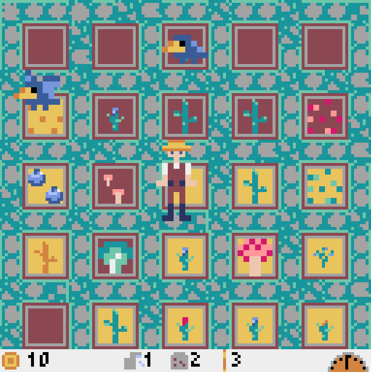

# GrowyGardens - 6h Hackathon 2022

*Version en français dessous*

Welcome to our garden in full growth: **Growy Gardens!** 

The objective of the game is to **grow the most plants** you can in **3 minutes** by quickly *running around*, **planting, watering and swatting** away hungry crows.

## Mechanics

- You automatically interact with the nearest garden cell
- Plants only grow if they are watered (yellow = dry, brown = wet)
- You can collect plants automatically by walking over them
- When crows are left un-attended on the plants for 5 seconds, they will eat the plant, locking off that cell
- Crows randomly land, and can be swatted away once they land
- The plant planted is randomly selected, and they each give unique points
- Points are displayed in the bottom left
- A day indicator is displayed in the bottom right
- Keybind reminders are at the bottom of the screen

## Keybinds

- **W or Up** Arrow: Move up
- **S or Down** Arrow: Move down
- **A or Left** Arrow: Move left
- **D or Right** Arrow: Move right

- **1 or J**: Water the garden
- **2 or K**: Plant a seed
- **3 or L**: Bonk a crow

## Installation

This game runs with [`pyxel`](https://github.com/kitao/pyxel), and can be installed with `pip install -U pyxel`

To play the game, run `python3 GrowyGardens.py`.

***GOOD LUCK!***

## Français

Bienvenue dans notre jardin en pleine croissance : Growy Gardens! 

L'objectif du jeu est de faire pousser 
le plus de plantes possible en 3 minutes en les plantant rapidement et en assommant les corbeaux qui ont 
faim!

### Touches

- **W ou Haut** Arrow: Bouger vers le haut
- **S ou Bas** Arrow: Bouger vers le bas
- **A ou Gauche** Arrow: Bouger vers la gauche
- **D ou Droite** Arrow: Bouger vers la droite

- **1 ou J**: Aroser la jardin
- **2 ou K**: Planter une graine
- **3 ou L**: Assomer un corbeau

## Installation

Le jeu utilise [`pyxel`](https://github.com/kitao/pyxel), et peut être installé avec `pip install -U pyxel`

Pour jouer, utilliser `python3 GrowyGardens.py`.

***Bonne chance!***
